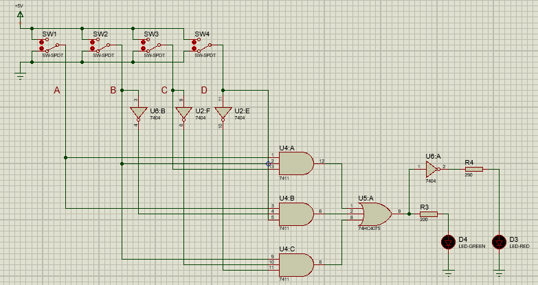

Diseño de un circuito de lógica combinatoria que indica si la letra seleccionada pertenece o no al apellido previamente escogido al momento de ingresar alguno de los códigos binarios de 4 bits a través de cuatro switches. Si la letra pertenece al apellido se enciende el LED verde, si no pertenece se enciende el LED Rojo.

