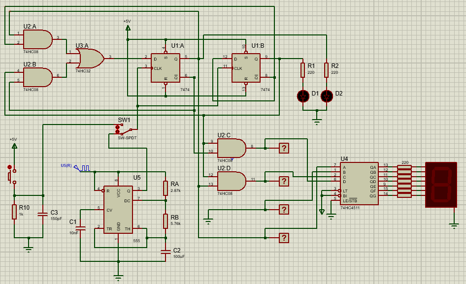

Diseñe un circuito sencillo con lógica secuencial, que muestre constantemente en un
displays 7 segmentos, los últimos cuatro números de su carnet. La condición es que estos
números no pueden ser consecutivos ni repetirse. Este montaje tendrá dos tipos de reloj
diferentes, los cuales se podrán conmutar a través de un interruptor de dos posiciones. El
primero será un oscilador astable, basado en un circuito integrado 555, con una
frecuencia de 1 a 2 Hz aproximadamente. El segundo será un swich tipo (normalmente
abierto), con el cual la rotación de los números del carnet se hará manualmente. Para este
último, debe investigar el concepto de switch antirebote.

