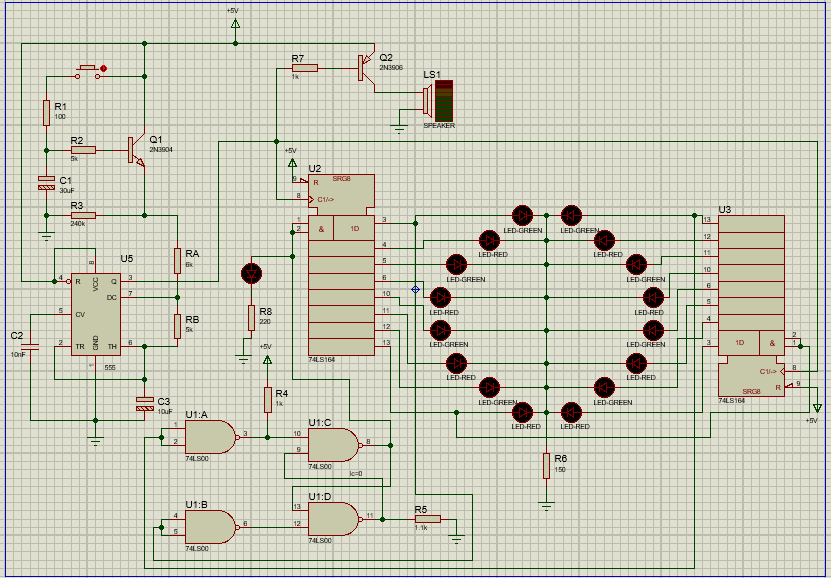

Diseñe un circuito sencillo basado en dos Shift Register (Registro de Corrimiento) conectados en serie que simule una
ruleta electrónica de casino. Este circuito se dividirá en 5 bloques, 3 de ellos se presentan en el pdf de la práctica. 
El primer bloque a diseñar será el reloj del montaje basado en un oscilador astable realizado con un 555. Cuando se presione el pulsador del bloque 2, este oscilador presentará en su salida una onda cuadrada, con la particularidad que su frecuencia decaerá en forma exponencial hasta detenerse. El tercer bloque generará el sonido de la ruleta, este
circuito estará conectado directamente a la salida del 555 y la corneta es del tipo de 4 a 8 ohmios de las presentes en radios
pequeños de mano. El cuarto bloque es el bloque de inicialización y reinserción del primer bit de rotación; este
bloque está basado en 4 compuertas NANDs las cuales conforman un Flip-Flop tipo RS de entradas negadas; este bloque
toma una muestra del primer y último bit de la ruleta y reinserta el primer bit de rotación por la entrada serial del Shift
Register. El 5to bloque, es el de los Shift Register como tal, cuyas salidas estarán conectadas a una serie de Leds Rojos y
Verdes intercalados y distribuidos en forma de anillos, los cuales representarán a la Ruleta. La actividad de esta práctica
consiste en diseñar el 1er y 5to bloque del montaje e interconectarlos a los bloques ya dados.

