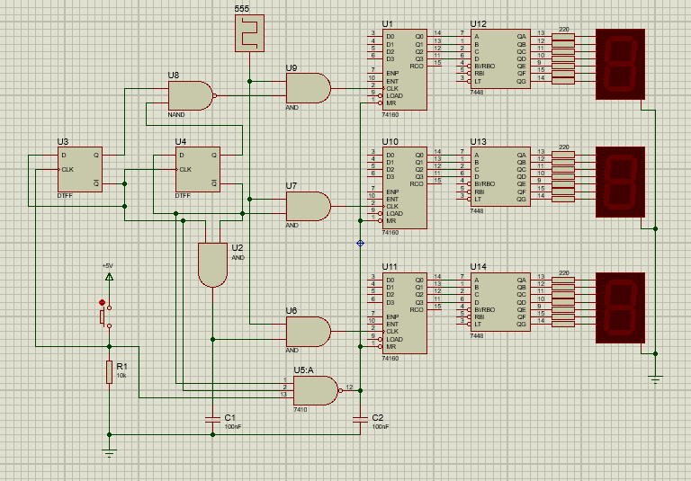

Diseño de un circuito secuencial que imite un juego de tragamonedas como los encontrados en un casino. Éste
circuito deberá tener 3 displays de 7 segmentos controlados por 3 contadores BCD individuales, los cuales
estarán corriendo constantemente de manera sincronizada movidos por un reloj 555 a unos 10Hz
aproximadamente. Se debe presionar un único pulsador para ir deteniendo cada contador uno a uno hasta que
los 3 estén detenidos y formen una combinación de tres números al azar. Al presionar por cuarta vez el
pulsador de control, los tres contadores se resetearán colocándose a cero y al soltar el pulsador, la secuencia
comenzará nuevamente.

