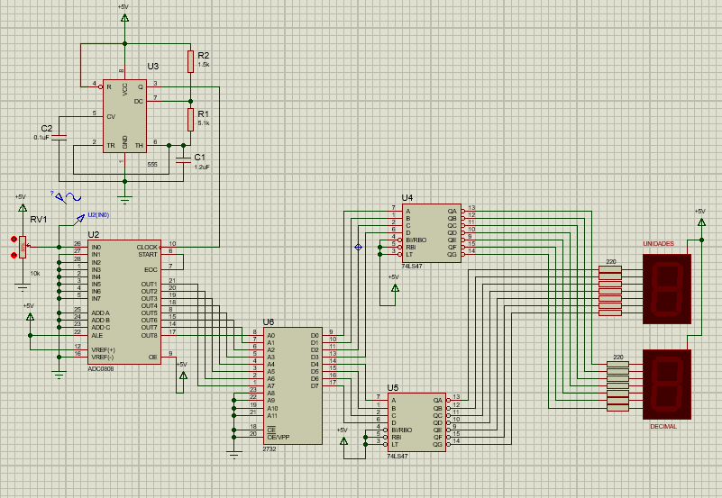
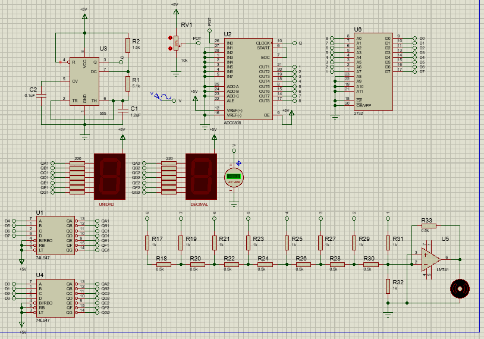

En esta práctica se diseñará un voltímetro digital, que mida los cambios de potencial,
producidos por las variaciones de posición del eje rotativo de un potenciómetro conectado a
una fuente de 5V. Las lecturas serán mostradas en dos displays de 7 segmentos que
representarán dos dígitos, un entero y un decimal. Por lo tanto la escala de este voltímetro
estará entre 0,0V y 5,0V.
Además se controlará la velocidad de un motor DC con la implementación de reder R-2R.

## Voltímetro 

## Control de motor DC

